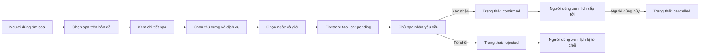
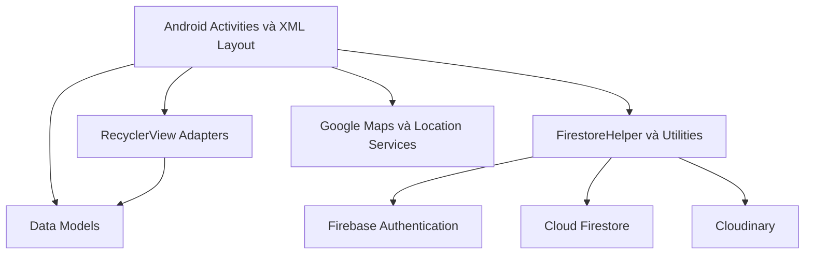

<div align="center">

# SenCare

### Trợ lý toàn diện dành cho người nuôi thú cưng

Ứng dụng Android hỗ trợ quản lý thú cưng, lưu giữ kỷ niệm, tìm kiếm dịch vụ chăm sóc theo vị trí, đặt lịch spa và tra cứu trạm thú y.


</div>

---

## Mục lục

- [Giới thiệu](#giới-thiệu)
- [Đối tượng sử dụng](#đối-tượng-sử-dụng)
- [Tính năng chính](#tính-năng-chính)
- [Hướng dẫn sử dụng nhanh](#hướng-dẫn-sử-dụng-nhanh)
- [Luồng đặt lịch spa](#luồng-đặt-lịch-spa)
- [Công nghệ sử dụng](#công-nghệ-sử-dụng)
- [Kiến trúc và cách tổ chức mã nguồn](#kiến-trúc-và-cách-tổ-chức-mã-nguồn)
- [Cài đặt và chạy dự án](#cài-đặt-và-chạy-dự-án)
- [Cấu trúc dữ liệu Firestore](#cấu-trúc-dữ-liệu-firestore)
- [Quyền ứng dụng](#quyền-ứng-dụng)
- [Lưu ý kỹ thuật và bảo mật](#lưu-ý-kỹ-thuật-và-bảo-mật)
- [Phạm vi phiên bản 1.0](#phạm-vi-phiên-bản-10)
- [Thành viên thực hiện](#thành-viên-thực-hiện)

---

## Giới thiệu

**SenCare** là ứng dụng Android được xây dựng nhằm tập trung các nhu cầu phổ biến của người nuôi thú cưng vào một nền tảng duy nhất. Thay vì phải sử dụng nhiều công cụ riêng lẻ, người dùng có thể:

- Quản lý hồ sơ của từng thú cưng.
- Lưu ảnh và những khoảnh khắc đáng nhớ theo dòng thời gian.
- Tìm spa thú cưng trong bán kính mong muốn.
- Xem thông tin spa và đặt lịch cho thú cưng.
- Theo dõi trạng thái lịch hẹn theo thời gian thực.
- Tra cứu trạm thú y trên bản đồ, gọi điện hoặc mở chỉ đường.
- Lưu giữ hồ sơ và lời tiễn biệt trong **Góc tưởng niệm** khi thú cưng qua đời.

Ứng dụng hỗ trợ hai vai trò độc lập:

1. **Người nuôi thú cưng** — quản lý thú cưng, nhật ký, tìm kiếm dịch vụ và đặt lịch.
2. **Chủ spa** — tạo hồ sơ spa và xử lý các yêu cầu đặt lịch từ khách hàng.

Phiên bản hiện tại: **1.0**.

---

## Đối tượng sử dụng

### Người nuôi thú cưng

SenCare phù hợp với người dùng muốn lưu trữ thông tin của nhiều thú cưng, theo dõi kỷ niệm, tìm dịch vụ chăm sóc gần vị trí hiện tại và quản lý lịch hẹn trên điện thoại.

### Chủ spa thú cưng

Chủ spa có thể xây dựng hồ sơ cơ sở của mình gồm tên, địa chỉ, số điện thoại, mô tả, dịch vụ, khoảng giá, hình ảnh và vị trí trên bản đồ; đồng thời tiếp nhận, xác nhận hoặc từ chối lịch đặt của khách hàng.

---

## Tính năng chính

### 1. Xác thực và phân quyền

- Đăng ký tài khoản mới.
- Lựa chọn vai trò **người dùng** hoặc **chủ spa**.
- Đăng nhập bằng email hoặc tên người dùng.
- Khôi phục mật khẩu qua email.
- Điều hướng đến màn hình phù hợp theo vai trò.
- Yêu cầu chủ spa hoàn tất hồ sơ spa trước khi sử dụng trang quản lý.

### 2. Quản lý hồ sơ cá nhân

- Xem thông tin tài khoản.
- Cập nhật họ tên và ảnh đại diện.
- Lưu ảnh trên Cloudinary và lưu URL ảnh trong Firestore.
- Đăng xuất khỏi ứng dụng.

### 3. Quản lý thú cưng

- Thêm hồ sơ thú cưng mới.
- Xem danh sách và thông tin chi tiết.
- Chỉnh sửa tên, loài, tuổi, tính cách và hình ảnh.
- Chụp ảnh bằng camera hoặc chọn ảnh từ thiết bị.
- Xóa vĩnh viễn hồ sơ khi người dùng xác nhận.

### 4. Góc tưởng niệm

Thay vì chỉ xóa hồ sơ khi thú cưng qua đời, SenCare hỗ trợ một luồng riêng mang tính lưu giữ và tôn trọng:

- Chọn ngày thú cưng ra đi.
- Viết lời tiễn biệt.
- Chuyển hồ sơ sang trạng thái `memorial`.
- Hiển thị ngày mất và lời nhắn trong giao diện tưởng niệm.
- Ẩn thú cưng khỏi danh sách đang chăm sóc và khỏi danh sách có thể đặt lịch.
- Tự động hủy các lịch hẹn sắp tới đang chờ hoặc đã được xác nhận của thú cưng.
- Cho phép xóa vĩnh viễn hồ sơ tưởng niệm khi người dùng thật sự muốn.

### 5. Nhật ký thú cưng

- Chọn một thú cưng để xem nhật ký riêng.
- Thêm ảnh từ camera hoặc thư viện.
- Viết chú thích cho từng khoảnh khắc.
- Hiển thị ảnh theo dòng thời gian.
- Xem chi tiết ảnh, nội dung và thời điểm tạo.
- Lưu ảnh trên Cloudinary, lưu dữ liệu mô tả trong Firestore.

### 6. Tìm kiếm spa theo vị trí

- Nhập bán kính tìm kiếm mong muốn.
- Xin quyền và lấy vị trí hiện tại của thiết bị.
- Tải danh sách spa từ Firestore.
- Tính khoảng cách giữa người dùng và từng spa bằng công thức Haversine.
- Chỉ hiển thị các spa nằm trong phạm vi phù hợp.
- Đặt marker riêng cho từng spa trên Google Maps.
- Hiển thị tên, địa chỉ và khoảng cách khi chọn marker.

> Khoảng cách Haversine là khoảng cách địa lý gần đúng theo đường chim bay trên bề mặt Trái Đất, không phải quãng đường di chuyển thực tế theo đường bộ.

### 7. Xem chi tiết spa

- Xem tên spa, hình ảnh, địa chỉ và số điện thoại.
- Xem mô tả, danh sách dịch vụ và khoảng giá.
- Xem khoảng cách từ vị trí người dùng đến spa.
- Chuyển trực tiếp sang màn hình đặt lịch.

### 8. Đặt lịch spa

Người dùng có thể:

- Chọn một thú cưng đang được chăm sóc.
- Chọn dịch vụ do spa cung cấp.
- Chọn ngày bằng `DatePicker`.
- Chọn giờ bằng `TimePicker`.
- Gửi yêu cầu đặt lịch đến spa.
- Nhận thông báo rằng lịch đang chờ spa xác nhận.

Lịch mới được tạo với trạng thái `pending`.

### 9. Theo dõi và quản lý lịch hẹn

#### Phía người dùng

- Xem lịch sắp tới.
- Xem lịch đã qua.
- Xem lịch bị spa từ chối.
- Theo dõi trạng thái cập nhật từ Firestore theo thời gian thực.
- Hủy lịch hẹn sắp tới khi không còn nhu cầu.

#### Phía chủ spa

- Xem danh sách lịch đang chờ xác nhận.
- Xác nhận lịch phù hợp.
- Từ chối lịch không thể tiếp nhận.
- Xem danh sách lịch đã xác nhận.
- Xem danh sách lịch đã từ chối.

### 10. Bản đồ trạm thú y

- Hiển thị các trạm thú y đang hoạt động trên Google Maps.
- Hiển thị thông tin cơ bản khi chọn marker.
- Mở trình quay số với số điện thoại của trạm.
- Mở Google Maps để chỉ đường đến vị trí đã chọn.
- Tự động chuyển sang trình duyệt nếu thiết bị không có ứng dụng Google Maps.

### 11. Quản lý hồ sơ spa

Chủ spa có thể:

- Tạo hồ sơ spa sau khi đăng ký.
- Cập nhật tên, địa chỉ, số điện thoại và mô tả.
- Khai báo danh sách dịch vụ và khoảng giá.
- Chọn vị trí spa trên bản đồ.
- Thêm hoặc thay đổi ảnh đại diện của spa.
- Xem lại hồ sơ đã công khai trong hệ thống.

---

## Hướng dẫn sử dụng nhanh

### Dành cho người nuôi thú cưng

1. Mở ứng dụng và chọn **Đăng ký**.
2. Chọn vai trò người dùng, nhập thông tin tài khoản và hoàn tất hồ sơ.
3. Vào **Quản lý thú cưng** để thêm ít nhất một thú cưng.
4. Sử dụng **Nhật ký thú cưng** để lưu ảnh và chú thích.
5. Vào **Tìm spa**, nhập bán kính tìm kiếm và cho phép ứng dụng truy cập vị trí.
6. Chọn một spa trên bản đồ, xem chi tiết và nhấn **Đặt lịch**.
7. Chọn thú cưng, dịch vụ, ngày và giờ rồi xác nhận.
8. Theo dõi kết quả trong **Lịch hẹn của tôi**.
9. Sử dụng **Bản đồ thú y** khi cần gọi điện hoặc chỉ đường đến phòng khám.

### Dành cho chủ spa

1. Đăng ký và chọn vai trò **Chủ spa**.
2. Hoàn tất hồ sơ spa gồm thông tin liên hệ, dịch vụ, hình ảnh và vị trí.
3. Vào trang chủ dành cho chủ spa.
4. Mở **Quản lý lịch đặt**.
5. Kiểm tra các yêu cầu đang chờ.
6. Chọn **Xác nhận** hoặc **Từ chối** đối với từng lịch.
7. Theo dõi các lịch đã xử lý ở từng thẻ trạng thái.

---

## Luồng đặt lịch spa



### Ý nghĩa trạng thái lịch hẹn

| Trạng thái | Ý nghĩa |
| --- | --- |
| `pending` | Người dùng đã gửi lịch, đang chờ chủ spa xử lý |
| `confirmed` | Chủ spa đã chấp nhận lịch |
| `active` | Trạng thái cũ vẫn được ứng dụng nhận diện tương đương lịch đã xác nhận |
| `rejected` | Chủ spa đã từ chối lịch |
| `cancelled` | Người dùng đã hủy hoặc hệ thống hủy lịch không còn phù hợp |

Việc một lịch nằm trong nhóm **sắp tới** hay **đã qua** được xác định dựa trên `bookingTimestamp` so với thời gian hiện tại.

---

## Công nghệ sử dụng

| Thành phần | Công nghệ | Vai trò trong dự án |
| --- | --- | --- |
| Nền tảng | Android Native | Xây dựng ứng dụng chạy trực tiếp trên Android |
| Ngôn ngữ | Java 11 | Xử lý nghiệp vụ và tương tác giao diện |
| Giao diện | XML Layout, Material Components | Xây dựng màn hình và thành phần UI |
| Liên kết giao diện | View Binding, Data Binding | Truy cập view an toàn và liên kết dữ liệu |
| Xác thực | Firebase Authentication | Đăng ký, đăng nhập và khôi phục mật khẩu |
| Cơ sở dữ liệu | Cloud Firestore | Lưu tài khoản, thú cưng, nhật ký, spa, lịch đặt và trạm thú y |
| Lưu trữ ảnh | Cloudinary | Lưu ảnh đại diện, ảnh thú cưng, nhật ký và spa |
| Bản đồ | Google Maps SDK for Android | Hiển thị spa, trạm thú y và vị trí được chọn |
| Vị trí | Google Play Services Location | Lấy vị trí hiện tại của thiết bị |
| Địa điểm | Google Places SDK | Hỗ trợ các thành phần liên quan đến địa điểm |
| Danh sách | RecyclerView, CardView | Hiển thị danh sách dữ liệu linh hoạt |
| Tải ảnh | Glide 4.16.0 | Tải và hiển thị ảnh từ URL |
| Quản lý mã nguồn | Git, GitHub | Lưu trữ và quản lý phiên bản dự án |

### Cấu hình Android hiện tại

| Thuộc tính | Giá trị |
| --- | --- |
| Application ID | `com.example.sencare` |
| Phiên bản | `1.0` |
| `minSdk` | `29` |
| `targetSdk` | `35` |
| `compileSdk` | `35` |
| Java | `11` |

---

## Kiến trúc và cách tổ chức mã nguồn

SenCare không áp dụng một framework kiến trúc phức tạp. Mã nguồn được tách theo trách nhiệm thành các nhóm chính:

- **Activity**: điều khiển từng màn hình và luồng tương tác.
- **Adapter**: kết nối dữ liệu với `RecyclerView`.
- **Model**: biểu diễn dữ liệu được đọc và ghi trong Firestore.
- **Utility/Helper**: gom logic dùng chung như Firebase, Cloudinary, ảnh, khoảng cách và tìm kiếm spa.
- **XML resources**: định nghĩa layout, màu sắc, chuỗi, theme và drawable.

### Sơ đồ kết nối tổng thể



### Cấu trúc thư mục chính

```text
app/src/main/
├── AndroidManifest.xml
├── java/com/example/sencare/
│   ├── MainActivity.java
│   ├── activities/
│   │   ├── auth/       # Đăng nhập, đăng ký, quên mật khẩu
│   │   ├── booking/    # Tìm spa, xem spa, đặt lịch, quản lý lịch
│   │   ├── diary/      # Nhật ký và dòng thời gian của thú cưng
│   │   ├── form/       # Biểu mẫu hồ sơ người dùng và spa
│   │   ├── home/       # Trang chủ theo vai trò
│   │   ├── map/        # Chọn vị trí trên bản đồ
│   │   ├── pet/        # Hồ sơ thú cưng và Góc tưởng niệm
│   │   ├── profile/    # Hồ sơ người dùng và hồ sơ spa
│   │   └── vet/        # Bản đồ trạm thú y
│   ├── adapters/       # Adapter cho danh sách và lựa chọn
│   ├── models/         # User, Pet, Diary, Spa, Booking, VetClinic...
│   └── utils/          # Firebase, Firestore, Cloudinary, Haversine...
└── res/
    ├── drawable/
    ├── layout/
    ├── mipmap/
    ├── values/
    └── xml/
```

### Một số lớp quan trọng

| Lớp | Trách nhiệm |
| --- | --- |
| `MainActivity` | Màn hình bắt đầu, cung cấp lựa chọn đăng nhập hoặc đăng ký |
| `FirebaseUtil` | Truy cập đối tượng Firebase dùng chung và người dùng hiện tại |
| `FirestoreHelper` | Đóng gói các thao tác đọc, ghi, cập nhật và truy vấn Firestore |
| `CloudinaryUtil` | Upload và xử lý ảnh trên Cloudinary |
| `ImageUtil` | Hỗ trợ chọn, chuyển đổi và xử lý ảnh |
| `HaversineUtil` | Tính khoảng cách địa lý giữa hai tọa độ |
| `SpaFinderUtil` | Lọc và sắp xếp spa dựa trên khoảng cách |
| `MapPickerActivity` | Cho phép chọn vị trí spa trên bản đồ |

---

## Cài đặt và chạy dự án

### 1. Yêu cầu môi trường

Trước khi chạy dự án, cần chuẩn bị:

- Android Studio có hỗ trợ Android SDK 35.
- JDK 11.
- Thiết bị thật hoặc máy ảo Android API 29 trở lên.
- Tài khoản Firebase.
- Google Cloud project có API key cho bản đồ.
- Tài khoản Cloudinary.
- Kết nối Internet.

### 2. Clone mã nguồn

```bash
git clone https://github.com/maihan88/SenCare.git
cd SenCare
```

Mở thư mục dự án bằng Android Studio và chờ Gradle Sync hoàn tất.

### 3. Cấu hình Firebase

1. Tạo một Firebase project.
2. Thêm Android app với package name:

```text
com.example.sencare
```

3. Tải tệp `google-services.json`.
4. Đặt tệp vào:

```text
app/google-services.json
```

5. Trong Firebase Authentication, bật phương thức **Email/Password**.
6. Tạo Cloud Firestore database.
7. Thiết lập Firestore Security Rules phù hợp trước khi triển khai cho người dùng thật.

> Các collection nghiệp vụ được ứng dụng tạo trong quá trình sử dụng. Riêng dữ liệu trạm thú y cần được thêm vào collection `vetClinics` để có marker hiển thị trên bản đồ.

### 4. Cấu hình Google Maps

Trong Google Cloud Console:

1. Bật **Maps SDK for Android**.
2. Bật **Places API/Places SDK** nếu sử dụng các chức năng địa điểm.
3. Tạo API key.
4. Nên giới hạn key theo package name và SHA-1 của ứng dụng.

### 5. Cấu hình Cloudinary và API key cục bộ

Mở tệp `local.properties` ở thư mục gốc của dự án và bổ sung:

```properties
MAPS_API_KEY=YOUR_GOOGLE_MAPS_API_KEY
CLOUDINARY_CLOUD_NAME=YOUR_CLOUDINARY_CLOUD_NAME
CLOUDINARY_API_KEY=YOUR_CLOUDINARY_API_KEY
CLOUDINARY_API_SECRET=YOUR_CLOUDINARY_API_SECRET
```

Giữ nguyên dòng `sdk.dir` do Android Studio tạo, ví dụ:

```properties
sdk.dir=C\:\\Users\\YourName\\AppData\\Local\\Android\\Sdk
```

Không đưa `local.properties` hoặc khóa bí mật thật lên GitHub.

### 6. Đồng bộ và chạy

1. Chọn **Sync Project with Gradle Files**.
2. Chọn thiết bị hoặc emulator API 29 trở lên.
3. Nhấn **Run**.
4. Khi được hỏi, cấp quyền vị trí và camera để sử dụng đầy đủ chức năng.

---

## Cấu trúc dữ liệu Firestore

### `users/{uid}`

```text
uid
email
fullName
username
role
avatarUrl
avatarPublicId
hasSpaProfile
spaId
```

Giá trị `role`:

```text
user
spa_owner
```

### `pets/{petId}`

```text
petId
ownerId
name
species
age
personality
imageUrl
imagePublicId
status
passedAwayAt
farewellMessage
createdAt
updatedAt
```

Các trạng thái chính:

```text
active hoặc rỗng   # Thú cưng đang được chăm sóc
memorial           # Hồ sơ đã chuyển vào Góc tưởng niệm
```

### `diaries/{diaryId}`

```text
diaryId
ownerId
petId
imageUrl
imagePublicId
caption
createdAt
updatedAt
```

### `spas/{spaId}`

```text
spaId
ownerId
spaName
address
phone
description
services
priceRange
imageUrl
imagePublicId
latitude
longitude
open
createdAt
updatedAt
```

`services` là danh sách chuỗi; `latitude` và `longitude` được dùng để đặt marker và tính khoảng cách.

### `bookings/{bookingId}`

```text
bookingId
userId
userName
petId
spaId
petName
spaName
serviceName
bookingDate
bookingTime
bookingTimestamp
status
createdAt
updatedAt
```

Các trạng thái được sử dụng:

```text
pending
confirmed
active
rejected
cancelled
```

### `vetClinics/{clinicId}`

Các document trạm thú y cần chứa tối thiểu:

```text
clinicId
name
address
phone
latitude
longitude
note
active
createdAt
updatedAt
```

Ứng dụng chỉ tải các trạm có `active = true`.

---

## Quyền ứng dụng

| Quyền | Mục đích |
| --- | --- |
| `INTERNET` | Kết nối Firebase, Cloudinary và Google Maps |
| `ACCESS_NETWORK_STATE` | Kiểm tra trạng thái kết nối mạng |
| `ACCESS_FINE_LOCATION` | Lấy vị trí chính xác để tìm spa và trạm thú y |
| `ACCESS_COARSE_LOCATION` | Hỗ trợ vị trí gần đúng |
| `CAMERA` | Chụp ảnh đại diện, thú cưng, nhật ký hoặc spa |
| `READ_EXTERNAL_STORAGE` | Đọc ảnh trên các phiên bản Android cũ đến API 32 |

Ứng dụng vẫn có thể mở một số màn hình khi người dùng từ chối quyền, nhưng các chức năng phụ thuộc vào camera hoặc vị trí sẽ bị giới hạn.

---

## Lưu ý kỹ thuật và bảo mật

### Không công khai khóa bí mật

Các giá trị sau không được commit lên repository:

```text
MAPS_API_KEY
CLOUDINARY_CLOUD_NAME
CLOUDINARY_API_KEY
CLOUDINARY_API_SECRET
google-services.json nếu repository được dùng công khai và cấu hình không phù hợp
```

### Cloudinary API Secret trong ứng dụng Android

Phiên bản hiện tại đọc `CLOUDINARY_API_SECRET` từ `local.properties` và đưa vào `BuildConfig` để phục vụ quá trình phát triển. Cách này phù hợp cho môi trường học tập hoặc demo nội bộ nhưng **không an toàn cho sản phẩm phát hành công khai**, vì dữ liệu trong APK có thể bị trích xuất.

Khi triển khai thực tế, nên sử dụng một trong các giải pháp sau:

- Upload không ký bằng upload preset được giới hạn chặt chẽ.
- Backend riêng tạo chữ ký upload.
- Cloud Function hoặc API trung gian giữ bí mật ở phía máy chủ.

### Firestore Security Rules

Không nên để Firestore ở chế độ cho phép đọc/ghi công khai. Quy tắc nên đảm bảo:

- Người dùng chỉ sửa hồ sơ của chính mình.
- Chỉ chủ sở hữu được sửa hoặc xóa thú cưng và nhật ký tương ứng.
- Người dùng chỉ quản lý lịch của mình.
- Chủ spa chỉ xử lý lịch thuộc spa do họ sở hữu.
- Dữ liệu spa và trạm thú y chỉ cho phép sửa bởi tài khoản phù hợp hoặc quản trị viên.

### Khoảng cách spa

Haversine chỉ dùng tọa độ để tính khoảng cách địa lý. Kết quả không xét:

- Mạng lưới đường bộ.
- Cầu, sông hoặc địa hình.
- Tình trạng giao thông.
- Thời gian di chuyển thực tế.

Do đó, khoảng cách hiển thị nên được hiểu là thông tin tham khảo để lọc spa gần người dùng.

---

## Phạm vi phiên bản 1.0

Phiên bản hiện tại tập trung vào các chức năng cốt lõi:

- Xác thực và phân quyền.
- Hồ sơ cá nhân.
- Quản lý thú cưng.
- Nhật ký và Góc tưởng niệm.
- Hồ sơ spa.
- Tìm spa theo bán kính.
- Đặt lịch và xác nhận lịch hai phía.
- Bản đồ trạm thú y.

Các chức năng chưa nằm trong phạm vi hiện tại:

- Thanh toán trực tuyến.
- Nhắn tin trực tiếp giữa khách hàng và spa.
- Đánh giá hoặc xếp hạng spa.
- Thông báo đẩy tự động.
- Đồng bộ lịch ngoài ứng dụng.
- Tối ưu tuyến đường và thời gian di chuyển.
- Trang quản trị hệ thống riêng.

Đây là các hướng có thể tiếp tục phát triển trong những phiên bản sau.

---

## Thành viên thực hiện

| Thành viên | Phần phụ trách chính |
| --- | --- |
| Trí | Xác thực tài khoản và hồ sơ người dùng |
| Trân | Hồ sơ thú cưng và nhật ký thú cưng |
| Hân | Tìm kiếm spa trên bản đồ và đặt lịch spa |
| Nghi | Chức năng chủ spa, bản đồ thú y và trang chủ |

---

<div align="center">

**SenCare — đồng hành cùng người nuôi trong từng khoảnh khắc chăm sóc thú cưng.**

</div>
